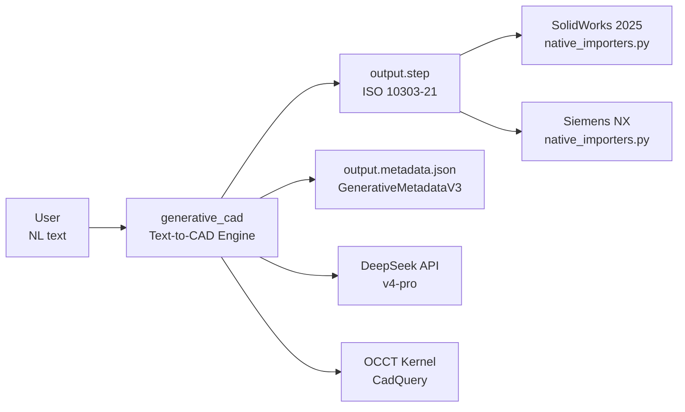
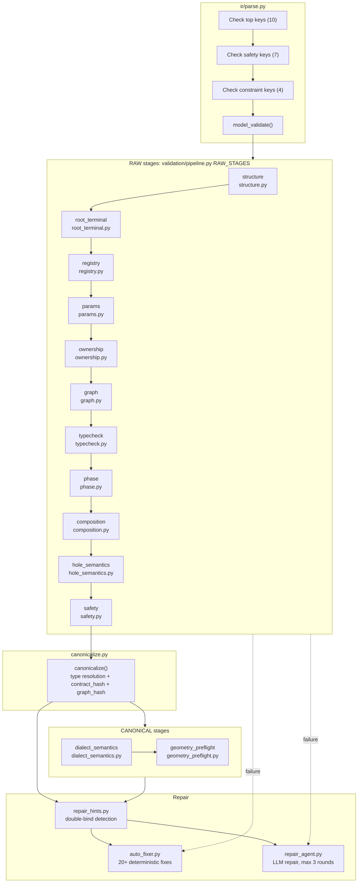
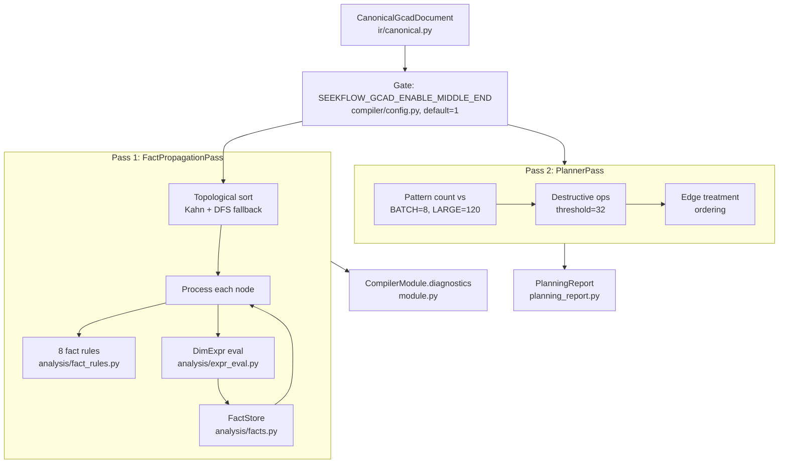
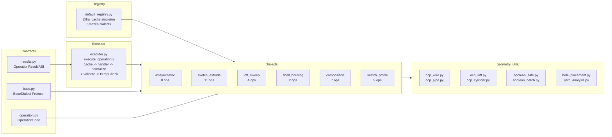
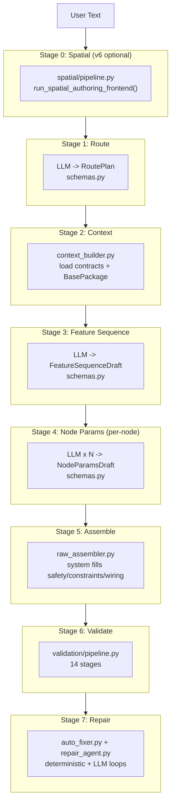
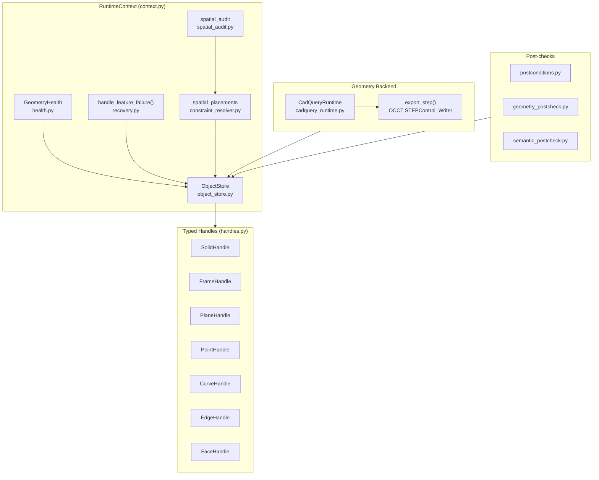
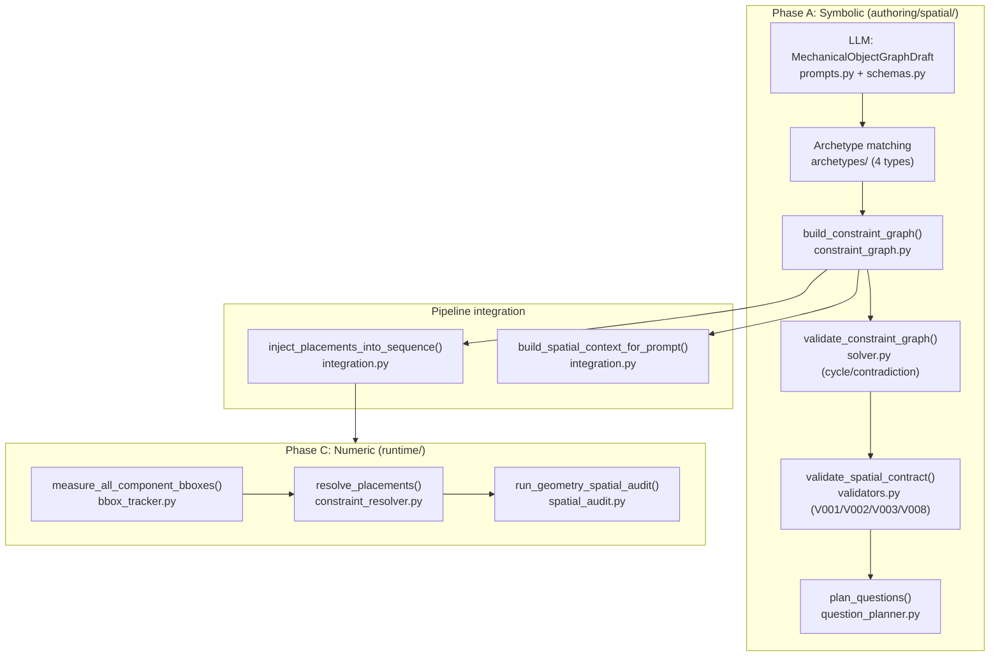
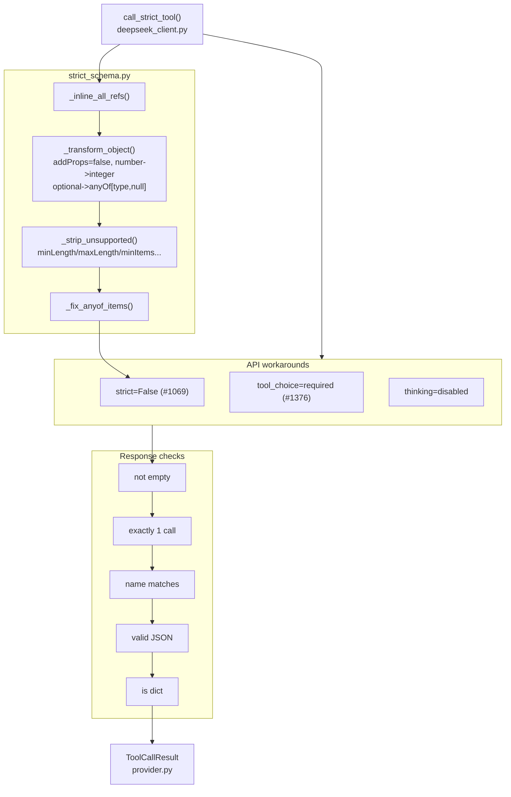
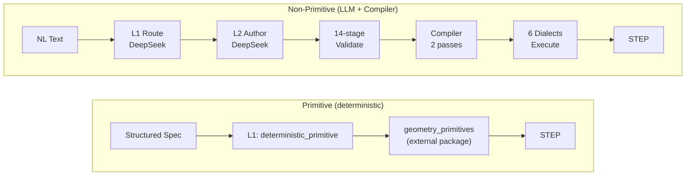

# generative_cad Architecture

> Node format: Chinese function label + English code identifier. Edges verified against actual import statements.
> Open `mermaid_viewer.html` for interactive viewing.

---

## 1. System Context

## 2. Pipeline Layers

```mermaid
graph TB
    subgraph L0["Entry"]
        builder["builder.py<br/>build_generative_cad_model()"]
        tools["tools.py<br/>9 Agent @tool functions"]
    end
    subgraph L1["Authoring"]
        bp["build_pipeline.py<br/>generate_validate_build_step()"]
        ap["pipeline.py<br/>generate_gcad_from_user_request()"]
        asm["raw_assembler.py<br/>assemble_raw_gcad_document()"]
        fix["auto_fixer.py<br/>auto_fix_with_report()"]
        ssch["strict_schema.py<br/>to_deepseek_strict_schema()"]
    end
    subgraph L2["LLM Interaction"]
        orch["orchestrator.py<br/>L1 + L2 prompt/tool builders"]
        dsc["deepseek_client.py<br/>DeepSeekToolCaller"]
        tc["tool_schema_compiler.py<br/>per-op JSON Schema"]
    end
    subgraph L3["IR"]
        raw["ir/raw.py<br/>RawGcadDocument"]
        can["ir/canonical.py<br/>CanonicalGcadDocument"]
        expr["ir/expr.py<br/>DimExpr / RefPath"]
    end
    subgraph L4["Validation"]
        vp["validation/pipeline.py<br/>14 stages"]
        vcan["canonicalize.py<br/>Raw to Canonical"]
        rh["repair_hints.py<br/>Repair hints"]
    end
    subgraph L5["Compiler Middle-End"]
        pm["pass_manager.py<br/>2 Passes"]
        fp["fact_propagation.py<br/>FactPropagation"]
        pl["planner.py<br/>Planning"]
    end
    subgraph L6["Dialects"]
        exec["executor.py<br/>execute_operation()"]
        reg["default_registry.py<br/>6 dialects"]
        gutils["geometry_utils/<br/>OCP wire/pipe/loft"]
    end
    subgraph L7["Runtime"]
        ctx["context.py<br/>RuntimeContext"]
        store["object_store.py<br/>ObjectStore"]
        cq["cadquery_runtime.py<br/>STEP export"]
        rec["recovery.py<br/>Failure recovery"]
        cs["constraint_resolver.py<br/>Placements"]
    end
    subgraph L8["Output"]
        run["pipeline/run.py<br/>run_canonical_gcad()"]
        art["artifact.py<br/>CanonicalStepArtifact"]
        meta3["metadata_v3.py<br/>Metadata proof"]
        gate["import_artifact.py<br/>Import gate"]
    end

    builder --> vp
    builder --> run
    tools --> builder
    bp --> ap
    ap --> asm
    ap --> fix
    ap --> vp
    orch --> dsc
    orch --> tc
    dsc --> ssch
    asm --> reg
    vp --> vcan
    vp --> rh
    vcan --> reg
    pm --> fp
    pm --> pl
    fp --> expr
    exec --> reg
    run --> pm
    run --> reg
    run --> cs
    run --> cq
    cq --> gutils
    meta3 --> ctx
    art --> meta3
    gate --> meta3
```

## 3. Data Flow: Text to STEP

## 4. Validation Pipeline (14 stages)

## 5. Compiler Middle-End

## 6. Dialect Layer

## 7. Staged Authoring Pipeline

## 8. Runtime Layer

## 9. Spatial Subsystem (v6)

## 10. DeepSeek API Adapter

## 11. Two Paths: Primitive vs Non-Primitive

---

*Diagrams regenerated 2026-06-06. All edges verified against actual `from ... import` statements in source.*
