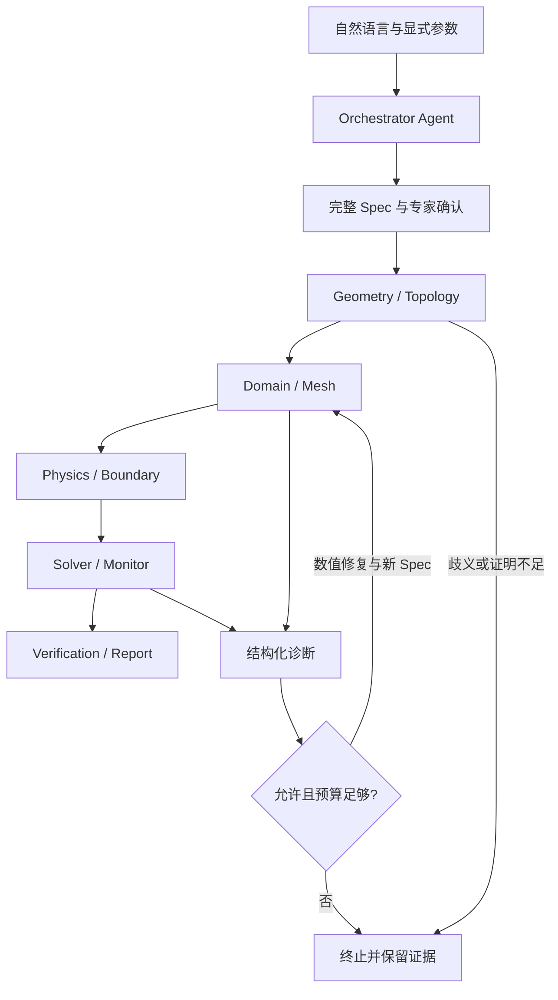

# 自动 CFD Agent：架构与实施设计

## 1. 基线与实现边界

读取的仓库基线：`main@606ab553cea1a9697333c63524396d15867d84e5`。
需求来源：`docs/自动CFD仿真-Agent需求文档.md`，2026-09-09 版。

交付目标是完整可验证的控制/决策/证据框架，以及本地 Ansys 的明确执行合同。真实求解器、实际商业许可、Fluent/CFX 版本适配、Windows Job Objects supervisor 和真实物理标定由本地环境完成。
该边界遵循用户要求，不将 Mock 完成计为真实 CFD 完成。

首期软件演示采用稳态、不可压缩、层流、等温内流的显式 Spec。它是测试夹具，不擅自把“涡轮盘”推断为旋转盘腔、外流或共轭传热。
Spec 已能表达扇区、外域、提取域、层流/RANS、能量/CHT、旋转和有终止时间的瞬态；只有能力表与本地验收都支持时才能执行对应物理模型。

## 2. 深读现有系统后的关键判断

| 现有入口 | 确认到的行为 | CFD 使用方式 |
| --- | --- | --- |
| `app/text-to-cad/server/agentic_l2.py` | 调用 `caller.call_strict_tool`；Agent 输出结构化对象，之后组装/验证并追踪修复 | 复用调用协议，不导入其盘体轮廓专用 prompt/模板 |
| `generative_cad/pipeline/run.py` | 显式 TopologyRunConfig，支持 revision、OCAF 生成/验证和 CAE preflight | 生成结果通过不可变 GeometryRef 进入独立 CFD 包 |
| `ocaf/revision_store.py` | revision 目录包含 XBF/STEP/metadata，HEAD 可能变化 | CFD 必须固定 revision 文件与哈希，不追随可变 HEAD |
| `ocaf/selection_service.py` | 原生 TNaming solve，有 UNIQUE/SET/AMBIGUOUS/DELETED 等状态；有 largest_area split 策略 | 仅接收原生正向证明；拒绝猜面及 largest_area |
| `ocaf/cae_preflight.py` | 兼容模式下 history_complete=None 不触发不完整门；proof 门主要排除 heuristic | CFD 独立增强证明检查，不修改原 CAE 行为 |
| `ocaf/capture_session.py` | history_complete 来自批次；空列表 all() 也会给 True | CFD 投影要求 batch_count>0、校验通过、完整历史 |
| `ocaf/solve_worker.py` | 原服务已有原生崩溃隔离经验，但输出偏几何摘要，不能传递可直接用于网格的身份 | 新 worker 使用 JSON 参数文件，并导出真实 BRep 面 |
| `server/fea3d/mesh_sector.py` | 当前结构网格通过质心/法向分类、距离匹配周期面 | 不作为 CFD 身份绑定核心；只借鉴阶段划分 |
| `ansys/apdl_runner.py` | 现有 Mechanical APDL 批处理；nproc 尚为保留参数 | 不把它假装为 Fluent CFD 后端；新建独立资源与 RPC 合同 |
| `_main_experiment/runner.py` | record_id、collected_at、指标汇总、恢复记录模式 | 保持审计字段可关联，但 CFD 使用独立 schema 与目录 |

特别注意：稳定拓扑身份不等于 STEP 导入后的 face index 稳定。CFD 必须传递实际命名面和域构造来源关系，再验证网格和 solver zone 的对应关系。

## 3. 分层与状态机

Agent 只拿到结构化上下文，不持有 shell、filesystem 或 solver session。
确定性状态机独占执行权；通用工具注册表在每次调用时校验角色、输出 schema，并由对应阶段的质量门决定能否进入下一步。
各后端可对同一声明式通用算子实现自己的步骤，但不能内置隐藏的盘体专用任务模板。

阶段为：`preflight → topology → domain → mesh → physics → initialize → solver → postprocess → complete`。
solver 是受迭代/时间预算约束的循环；状态检查点在每次可靠边界持久化。

## 4. 唯一事实源与硬约束

`SimulationSpec` 使用 Pydantic v2，禁止额外字段与 NaN/Inf；规范 JSON 排序后 SHA-256。
所有操作、域、网格、求解证据与结果携带同一有效 Spec 哈希。

- 几何：lineage、revision、CAD record_id、三类产物哈希、长度单位。
- 域：full/sector/extract/outer、构造策略、流/固体区域、生成面、轴、原点、边界盒。
- 网格：method、全局与局部尺寸、边界层、单元数硬上限和质量阈值。
- 物理：时间模式、湍流、热模型、旋转、参考压力/温度、重力。
- 材料：区域归属、密度、黏度、导热率、比热、温度表，以及可压缩理想气体参数。
- BC：稳定选择/生成面、基数、显式输入量、周期/接口配对和周期变换。
- 求解：算法、阶数、松弛、块大小、总迭代/物理时间。
- 验收：所有激活方程的残差、质量/能量误差、Courant、监测量稳定性和窗口。
- 输出：表面 reduction、单位、边界及专家预期范围。
- 预算：累计时间、CPU、内存、工具、Agent、修复、输出量。

`explicit_parameters` 在规划入口按嵌套字段验证。确认 Spec 后，所有非白名单字段都固定；修复只能改变显式允许的尺寸或松弛参数，不能放松阈值、改变物理和边界或扩大预算。

## 5. 拓扑桥与域传递

第一步校验 GeometryRef 的文件路径和内容哈希，再检查与该 revision 绑定的完整历史侧车。
第二步打开不可变 XBF，读取 stable label index，批量原生 solve。
第三步以实际 TopoDS_Shape 去重，导出 BRep 与当前会话句柄映射；序号、面积、法向、最近点都不用于决定身份。

域适配器的证明规则：

1. 原面未改变：沿用已证明的句柄。
2. 原面分裂/合并：报告新的句柄及完整 `parent_entity_ids`；必须来自真实 kernel history。
3. 扇区/外域生成面：必须明确 source_key，返回 exact_construction/exact_kernel_history 来源。
4. 所有外边界库存必须被显式 BC 完整覆盖；拒绝重叠与未分配面。
5. 网格与 solver 的命名 zone map 必须与上述域映射一致。

原生证据的真实性依赖受信任适配器，不是仅靠 JSON 校验就能证明。因此真实后端验收必须包含：导入后命名面与域边界对应、扇区新面的来源、网格 zone 后的对应、参数变化后的复验。

`check_role_binding_stable` 在同 lineage 的两个 revision 中重新原生求解同 selection_id，返回各自的证明；不是比较当前 face handle 的字符串是否相等。

## 6. 收敛、物理复核与网格研究

不使用“返回码 0”或后端一个 `converged=true` 作为成功依据。
每个 Sample 必须提供激活方程残差、完整边界带符号通量、源项/储存项、Courant 和请求量监测值。

相对质量误差：

`abs(sum(outward boundary flux) + storage - source) / max(sum(abs(flux)), abs(source), abs(storage), 1e-30)`。

能量使用相同符号约定。对零通量封闭域仍检查源项/储存项是否平衡。

连续窗口必须同时通过残差、守恒、Courant 与监测量稳定性；瞬态还需达到要求的物理终止时间。
发散、停滞、缺方程、缺日志、错误单位、重复迭代均产生结构化诊断。量级可疑的数值要求人工复核。

持续非定常流动不能用“监测量恒定”作为通用验收；该首版控制框架对此不声称物理全覆盖。统计周期、时间离散误差和湍流统计等应作为后端/验收扩展，增加对应 Spec 和证据合同后再声明能力。

网格无关性函数要求三个同几何/同物理的真实成功记录，比较连续细化后的指标相对变化；不会伪造 Richardson 阶数或 GCI。单次结果明确 `mesh_independence.verified=false`。

## 7. 本地 Worker 与部署

完整方法表与配置见 `integrations/cfd/README.md`。
默认实现是固定 operator 命令的文件 RPC；以 call_id + input_hash 关联响应，所有操作处于独立 job 目录。
代码中没有由 Agent 写 APDL、TUI、Python 或 shell 后执行的路径。

用户需在本地完成的工作：

| 本地工作 | 验收证据 |
| --- | --- |
| Fluent/CFX 启动、许可及版本配置 | capabilities 与实际安装一致，启动/失败均结构化 |
| 域构造及 named BRep → 域边界传递 | 真正的 parent/source history、边界全集覆盖 |
| 网格与周期映射 | 实际单元质量、最小体积、周期节点误差、zone 对应 |
| 材料/BC/物理设置 | 与 Spec 同哈希的设置与持久化项目 |
| 分块求解与 checkpoint | 原始残差、全边界通量、迭代与物理时间、日志与 restart |
| 后处理 reduction 与场文件 | 值、SI 单位、指定边界、真实导出文件 |
| Windows 或严格容器隔离 | 进程树终止、CPU/内存限制、输出边界、许可证释放 |

Linux supervisor 依赖 `/proc` 与 CPU affinity，有限频率检查进程组内总 RSS；并不是恶意原生程序隔离沙箱，也不是 cgroup 级严格总内存限额。
Windows 需要 Job Objects 或部署在具备资源限制的本地容器/调度器。接口允许替换 supervisor，不允许假装已限制资源。

## 8. 审计、恢复与批量

每个 job 有唯一 record_id；CAD record_id 与 revision 单独保留。
原始/修复 Spec、工具输入输出、失败诊断、网格、日志、残差与指标分层落盘。
事件链和文件清单用于发现意外篡改；不是带签名的防敌手认证机制。

恢复必须匹配原始 Spec 与后端能力版本，并通过清单校验。中断在明确 checkpoint 时可以继续；中断发生在未完成的外部调用时，执行幂等性未知，必须给出 capability_gap 而不是自动重放该调用。

`CFDService` 是有界本地队列，支持轮询、取消和恢复；不伪装成多节点持久消息队列。多机部署可在不变的 Backend/Spec 边界外添加数据库/调度系统。
CLI 的 batch 接受 Spec JSON 数组，输出独立 job，summary 按失败码与耗时聚合，真实/Mock 成功率分开。

## 9. 需求与验收映射

| 工作包 | 当前交付 | 尚需本地验收 |
| --- | --- | --- |
| WP0 范围决策 | 显式输入与专家确认机制；软件测试选用有界内流夹具 | 实际盘腔/冷却流道/CHT 场景、许可与预算 |
| WP1 Spec / schema | 完整版本化 IR、JSON Schema、校验和往返测试 | 真实任务参数基准 |
| WP2 拓扑桥 | OCAF 原生解析、实际 BRep 导出、含孔环半径扰动 POC | 完整榫槽/环槽设计族 + Fluent 网格 zone 传递 |
| WP3 域/网格 | 后端合同、全部边界覆盖、质量门和修复框架 | 真实域构造与真实网格 |
| WP4 物理/求解 | 通用工具、能力协商、严格 Worker RPC、限额、监控、恢复；D01 真实 Fluent 单点已通过 | CFX、湍流/旋转/瞬态与多设计族真实验收 |
| WP5 后处理 | 守恒/残差窗口、单位/范围、JSON/CSV/SVG/Markdown 报告 | 真实流量/温度/热流场与参考答案对照 |
| WP6 批量/回归 | 批量 API、汇总、失败分类、审计、原有拓扑测试回归 | 不同真实设计族的稳定性统计 |

D01 受限验证算例已经完成真实 Fluent 单点：240 次迭代收敛，质量守恒相对误差
`1.70e-08`，结果提取成功。失败的高 Re 横向绕流仍作为能力边界证据保留。
该单点不等同于真实批量成功率，也不代表湍流、旋转、瞬态或 CFX 已验收。
软件框架中没有使用 Mock 指标代替这些验收项。

## 10. 开源借鉴与取舍

- [Foam-Agent](https://github.com/csml-rpi/Foam-Agent)：参考其 Architect/Writer/Runner/Reviewer 分工、错误修复与 MCP 服务化；本项目基于已有 SeekFlow 协议实现独立专家角色，不引入它的代码生成执行路径或大规模 RAG 依赖。
- [PyFluent](https://github.com/ansys/pyfluent)：作为 Fluent 本地适配器的推荐官方 Python 接口；真正 API 调用和版本兼容留在本地 Worker。
- [PyFluent launcher 文档](https://fluent.docs.pyansys.com/version/stable/api/launcher/launcher.html)：用于理解启动边界；不把启动超时/求解超时/整个 job 超时混为一谈。

未复制这些项目的实现代码。参考的是系统边界和集成方式，不将其宣称的基准成功率迁移为本项目结果。

## 11. 本次实际验证结果

运行环境：Python 3.12、Pydantic 2.13.5、CadQuery 2.7.0；测试依赖安装在独立虚拟环境，未修改原项目依赖文件。

| 验证 | 结果 |
| --- | --- |
| `pytest integrations/cfd/tests -q` | 51 passed，5 skipped（Windows Job Object 可用，跳过不可用隔离分支） |
| `ruff check integrations/cfd` | 通过 |
| `ruff format --check integrations/cfd` | 26 个 Python 文件格式通过 |
| CLI validate / run / summary | Mock 端到端成功；真实成功率 null，而非将 Mock 计入 |
| D01 真实 Fluent 单点 | `success`；96,210 cells，最小正交质量 0.0683321，240 iterations，质量守恒误差 1.70e-08 |
| D01 高 Re 横向绕流边界 | 300 iterations 未收敛；定常层流不适用于该分离流，记录保留 |
| D05 孔/槽网格边界 | 129,160 cells，最小正交质量 1.19948e-03；未通过 0.05 门，保留为生成端待修复 |
| 原有 OCAF 全目录回归 | 313 passed，5 skipped，5 warnings |
| `_main_experiment/tests` 当前工作树 | 40 passed，6 failed |
| `_main_experiment/tests` 原始 main 独立 worktree | 40 passed，同样 6 failed |

另用真实 `deepseek-v4-pro` 对 D01 Spec 和结果做了独立专家审查：五类
Spec 审查全部 `accept`；首次结果审查因证据边界返回 `needs_input` 并完整保留；
补充逐迭代边界通量摘要和适用范围说明后，结果审查返回 `accept`。审查轨迹不含
任何 Solver 执行权限，保存于
`_cfd_experiment/output/dev/agent_reviews/d01-steady-lowre-1.json`。

4 个新测试跳过均因本环境不提供可读 `/proc`：Linux supervisor 的完整资源执行路径无法本地实测；另 1 个跳过是因为本机存在 Windows Job Object supervisor，测试不再走“隔离不可用”分支。原生 TNaming 和原生 BRep 子进程导出测试已实际运行通过；不能把它们等同于所有平台资源限额均已验收。

主实验基线失败项：

- `test_glmm_odds_ratio_returns_or`：统计结果为 not_computed。
- `test_regen_builds_800`、`test_semantics_builds_320`、`test_tools_builds_160`：输入任务集为空。
- `test_infeasible_builds_120`、`test_infeasible_precheck_rejects_categories`：空任务集导致模零错误。

这些失败在未修改的 `606ab55` 上复现；本次没有改动对应代码或放宽其测试。
新增独立 CI workflow 分 core/native 两种依赖场景执行新模块测试。
